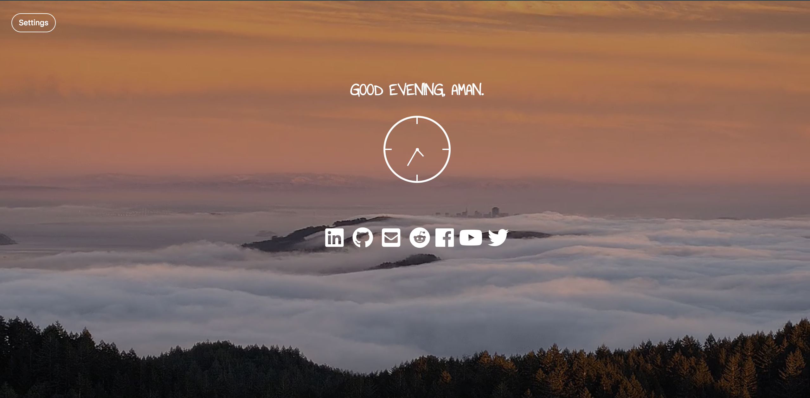

# Custom-Dashboard

A Chrome Extension built using HTML, CSS, and JS that overrides the new tab to use this custom new tab page that greets the user, shows the current time, and has various shortcuts to some of the most popular sites.

Sample

